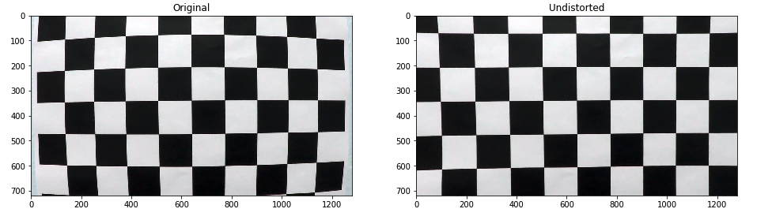
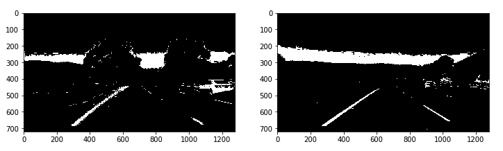
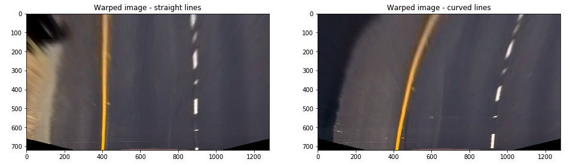

# Advanced Lane Finding Project
---
The goals of this project are the following:
- Compute the camera calibration matrix and distortion coefficients given a set of chessboard images.
- Apply a distortion correction to raw images.
- Use color transforms, gradients, etc., to create a thresholded binary image.
- Apply a perspective transform to rectify binary image ("birds-eye view").
- Detect lane pixels and fit to find the lane boundary.
- Determine the curvature of the lane and vehicle position with respect to center.
- Warp the detected lane boundaries back onto the original image.
- Output visual display of the lane boundaries and numerical estimation of lane curvature and vehicle position.

## Rubic points
---
### Camera Calibration
**Have the camera matrix and distortion coefficients been computed correctly and checked on one of the calibration images as a test?**

You can find my code in the P4 iPython notebook called P4.ipynb. The lines are found in code cell 2 - 6.

In cell 2 I have created a class to hold the object and image points and to eventually callibrate the camera (lines 3 - 48).

In cell 3 you'll find a function to actually detect the corners of the chessboard and add the object and image points to the class (lines 2 - 9).

And in Cell 4 you'll find the setting of the parameters (lines 1 - 4), the constructing of the class (line 6) and the analyzing of the calibration images (lines 10 - 15). The images are loaded, the corners are detected and added to the class and the detected images are plotted.

Cell 5 shows a quick print of the object and image points to check whether the function has as many image points as object points inserted.

Cell 6 shows a function to undistort an image based on the objectpoints class (line 1 - 3) and it shows a test image, the first one of the calibration set both undistorted and distorted (line 6 - 14).



### Pipeline
***1. Has the distortion correction been correctly applied to each image?***

The final pipeline is called the process_image function and is found in cell 20 on line 43 - 97. An image is fed by the ```fl_image()``` function in cell 23 line 6. The image is converted to BGR as the ```fl_image()``` function outputs RGB where I previously worked with the matplot imread function which outputs BGR (line 44). Its then passed to the ```undistortImage()``` function (cell 20, line 45) which undistorts it.

***2. Has a binary image been created using color transforms, gradients or other methods?***

Yes, cell 7 and 8 hold the code. In cell 7 there is a function to:

- perform an absolute sobel threshold (line 4 - 13)
- perform a magnitude thershold (line 16 - 25)
- perform a directional sobel threshold (line 28 - 35)
- perform a color mask (line 38 - 43)
- perform a color saturation threshold (line 48 - 53)

I have tested different combinations but ended up using the magnitude, the direction, the saturation and a color mask set to only let through yellow and white(ish). (line 55 - 62). To find the right parameters I have set up a test pipeline and used the interact widget to create parameter sliders (cell 141).



***3. Has a perspective transform been applied to rectify the image?***

In order for me to apply a perspective transform I had to set source and destination points. I have done this by selecting source points on an image (cell 8 lines 1 - 20) and optically transform these to a rectangle (cell 9 line 1 - 7). This led to the following arrays of points:

```
src = np.float32([
    [750, 490],
    [535, 490],
    [260, 680],
    [1045, 680]
])
dst = np.float32([
    [900, 455],
    [400, 455],
    [400, 715],
    [900, 715]
])
```

These points where fed to the ```cv2.getPerspectiveTransform()``` function to create a matrix (and an inverse matrix) on cell 9 lines 9 - 10 and then a test image was warped. I have plotted the warped images and checked for wether the lines where still running parallel.



***4. Have lane line pixels been identified in the rectified image and fit with a polynomial?***

Yes. This was done in several steps. First I found the base of the images using a histogram. I wrote a function called ```find_base()``` which takes in an image and outputs the histogram of the image in the bottom half as well as the midpoint and it's left and right lane peak. Cell 10.

I then wrote 2 main functions:

#### 1. find_lanes_initial()

This takes in the binary, the left and right base coordinate and optional parameters such as: the number of windows, the margin, the minimal amount of pixels that need to be found and wether or not the output should be visualized in a plot (cell 11).

It finds the x and y coordinate of all non black pixels (line 3 - 5) and it divides the image vertically into 9 windows. 1 for the left image and 1 for the right image. Whenever it finds non black pixels in the windows (line 24 for left, line 25 for right) it saves the coordinates of the pixels. If there is more than a minimum amount (line 28 and line 30) it will save the mean of the pixels x coordinates to the new x coordinate of the line (line 29 and 31). It also sets the new found x coordinate as the new base (thus moving the window on the next vertical line). All x coordinates together form the line (line 33 - 39).

If coordinates are found a 2nd order polynomial coefficient is calculated (line 42 - 43) and the polynomial line is plotted over the image (line 54 - 55). All found non black pixels are colored, red for left blue for right (line 48 - 49) and the whole canvas is stored and outputted (line 57, line 62).

#### 2. track_lanes()

If a line is already detected the track_lanes function can be used to more easily detect the line. It takes in the binary and the left and right polynomial coefficient. It then looks for non black images within a set margin (100 by default) (cell 12, lines 5 - 6). As with the previous function it calculates the polynomial coefficients (line 14 - 15) and it constructs them (line 17 - 19). Different is the sanity check, which calculates the slopes (using the height of the image as y2 - y1 and the first and last coordinate of the polynomial as x2 - x1) and returns False if the difference in slope is more than 0.9 (found imperically).

***5. Having identified the lane lines, has the radius of curvature of the road been estimated? And the position of the vehicle with respect to center in the lane?***

Yep! The function to calculate the curvature can be found in cell 14: ```calculateCurvature()``` and ```curvature()``` and cell 16 ```offset_middle()```.

To calculate the curvature I have first calculated the 2nd  order polynomial function in M's instead of pixel space (cell 14 line 2 - 4), I can then easily return the curvature by using the formula: ```Rcurve = (1 + (2Ay + B) ^ 2) ^ (3/2) / |2A|```. You can find it in my code on line 5.

An example of the outcome of this formula is found in cell 15.

In cell 16 you find the offset formula. Again I have converted from pixel space to real world (cell 16, line 2). I have then selected the value of the left and right line at the bottom of the image and used the difference between them to calculate the width of the image. By substracting the midpoint of the lines from the midpoint of the image we can than find the offset (line 6).

### Pipeline (video)

***1. Does the pipeline established with the test images work to process the video***

Yes! It runs by inserting the image into the ```process_image()``` function (cell 20, line 43). Here the image is converted to BGR (for consistency) (line 44), it's undistorted (line 46), its warped to birds-eye view (line 47) and the original image is warped for debug purpose (line 48).

The base of the image is found (line 49) and then we check whether the lines are already detected in the previous frame. If not the find_lanes_initial function is called (line 52), or else the track_lanes function is called (line 59).

If a fit is found the line objects are updated (line 61-66), the curvature and offset is calculated (line 71-72) and everything is visualized (line 74 - 97).

The video itself is loaded in cell 23 (line 4). A short is created for testing (line 5) and the video is processed and stored (line 6-7). View the result [here](./output_video.mp4)

### Readme

***1. Has a README file been included that describes in detail the steps taken to construct the pipeline, techniques used, areas where improvements could be made***

Yes

---
## Discussion
---

I noticed that especially the processing of the image (sobel gradients, magnitude, color masks etc) had a profound effect on the performance of the pipeline. Using the interact widget greatly helped to find the best possible parameters. I also noticed that this solution is much less robust than machine learning. It's primarily about parameter tuning and sanity checks. I could improve the network by adding more sanity checks, but it's already quite performant on the test video and honestly I am running out of time :(
